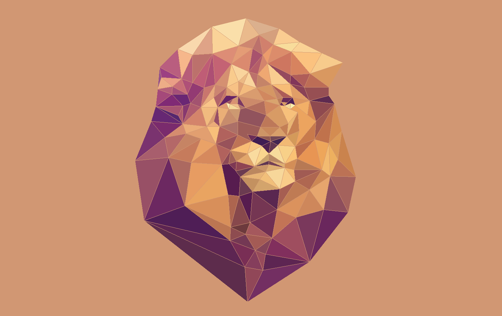
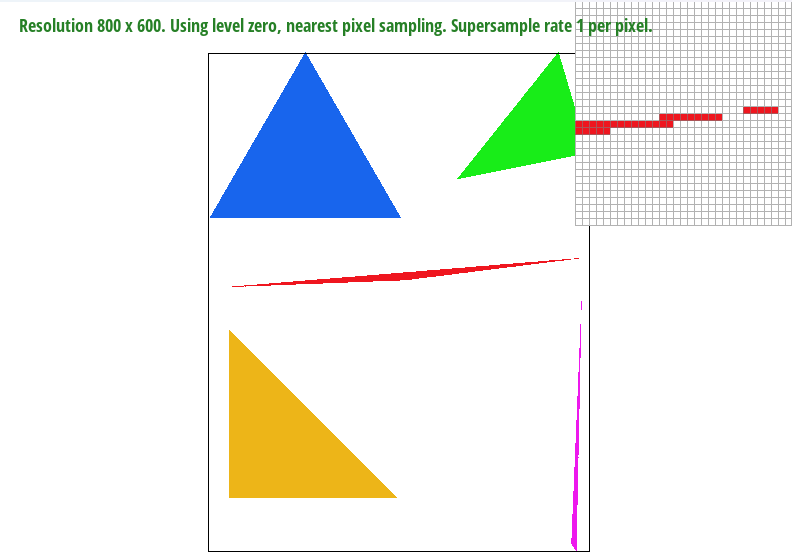
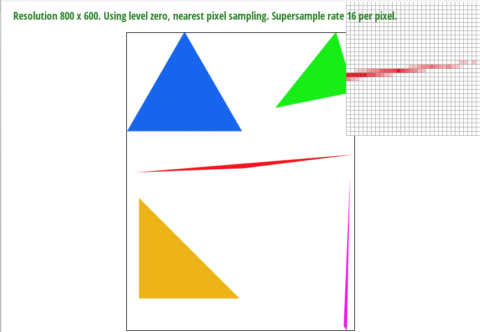
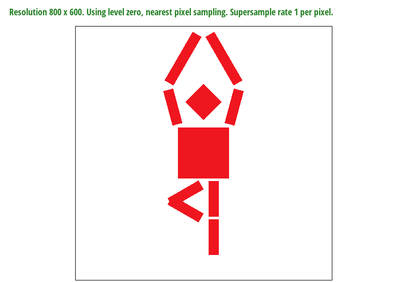
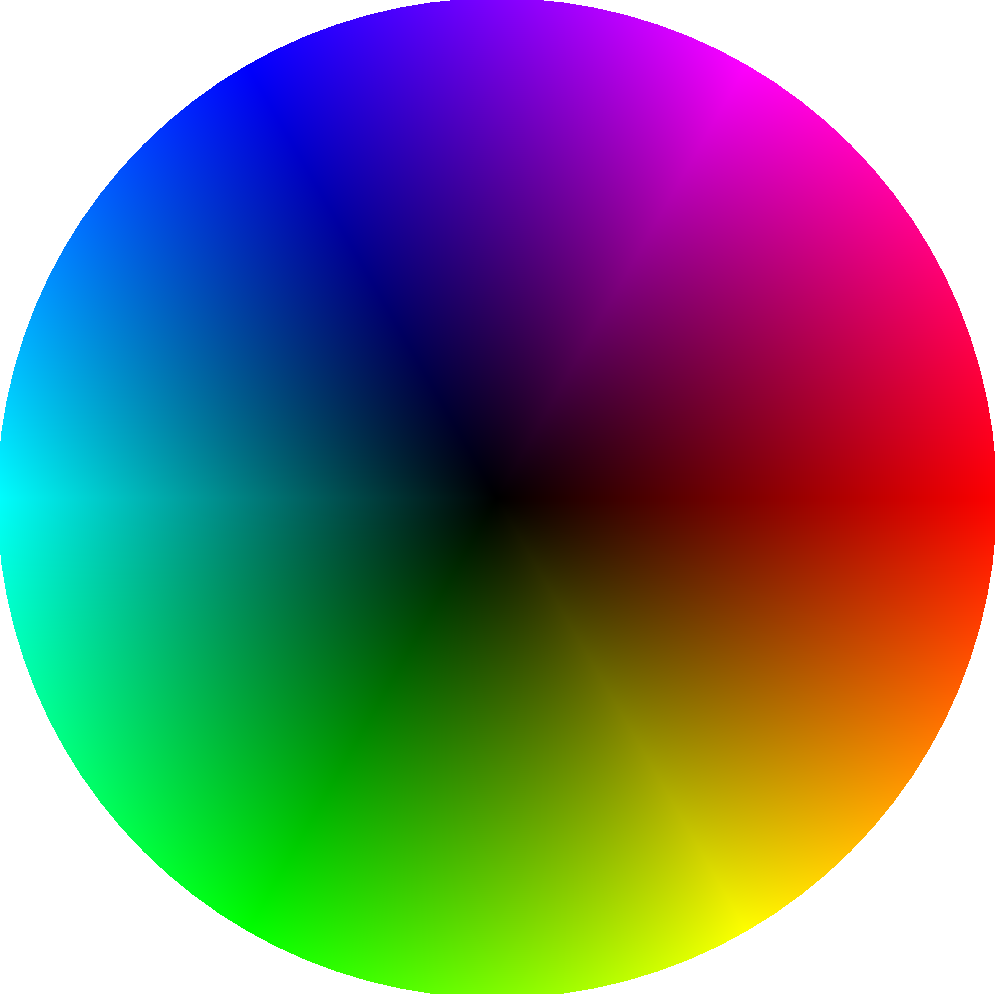
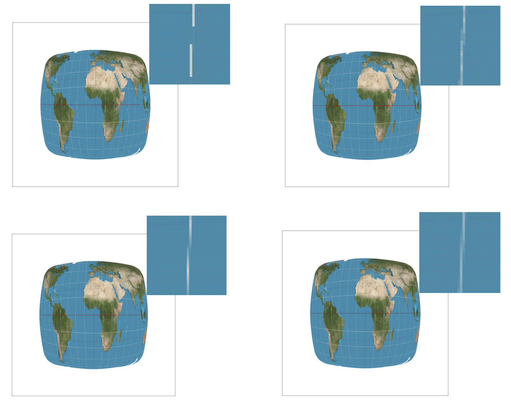
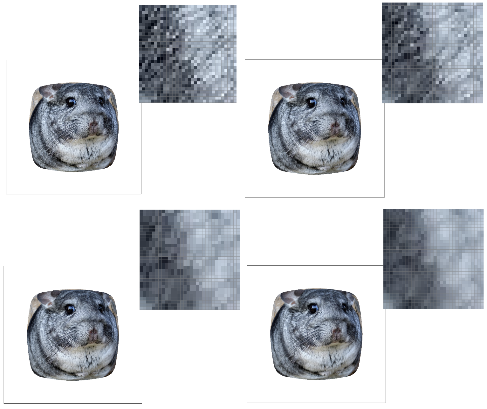

# Overview

For this project, we explored many fundamental ideas in computer graphics,
including rasterization, transformations, barycentric coordinates,
change-of-bases, interpolation, and texture mapping. Each of these tasks
involved its own individual challenges, and overall worked together to display
complex images.

We began by implementing a naive algorithm to rasterize a triangle, in which we
sample one point for each pixel in the framebuffer. While relatively fast and
memory-efficient, this runs into some problems, particularly in high-frequency
areas of our image, where we may run into jaggies and other aliasing artifacts.

To alleviate some of the artifacts, we implemented a supersampling algorithm
which results in less aliasing at the expense of computation and memory.

With this, we are able to display triangles, and can deal with artifacts with
higher sampling rates. However, we are still lacking a way to transform objects.
Scaling, rotation, and translation (and their combinations) are all common
transformations, and so we implemented these with matrices.

Next, we turned to barycentric coordinates as a way to easily interpolate
between triangle vertices, particularly with colors, and would prove useful with
the remaining task, texture mapping, where we used a change-of-basis into
barycentric coordinates along with different pixel- and level-sampling methods
to render textures.

We learned a lot about how graphics are rendered, transformed, and used in
conjunction with textures to build an image. There is so much more to be
explored here, particularly with implementation details for optimizing both
speed and quality, and we were captivated by how rich this topic can be. Some
interesting thoughts and challenges we had over the course of the project
include: 
- Averaging each pixel on-the-fly and then writing to the sample buffer without
having to store each supersample
- Numerical precision cascading errors with repeated operations on
floating-point numbers
- Implicit matrix-vector solutions and tradeoffs with regards to speed and
accuracy, especially near polygon edges
- Jittering points close to triangle edges may result in them being on the
outside of both triangles

Overall, this project was instrumental in learning the fundamentals of
rendering. We can now rasterize, transform, and texture objects - enough for
many graphics applications!

# Task 1

### Walk through how you rasterize triangles in your own words.

Unfortunately, we usually don’t have infinite precision on our displays, so
we need to have some way of translating infinitely-detailed triangles to
discrete pixels. To do this, we will choose the midpoint of each pixel in
the triangle and check if it falls inside the triangle. This involves, for
each edge of the triangle, determining whether the point falls inside or
outside that edge. If the point is on the same side of all three edges (all
inside), then we conclude that the point is inside the triangle. For points
directly on the edge, we chose to not implement the OpenGL rules, but
instead included them no matter which side of the triangle they reside.

### Explain how your algorithm is no worse than one that checks each sample within the bounding box of the triangle.

Our algorithm determines the minimum and maximum x- and y-values of the
triangle’s vertices, and uses these to form a bounding rectangle around the
triangle. We then step from the minimum to the maximum values to sample each
point and color it if inside the triangle, but ignore it if outside. This is
precisely the algorithm that checks each sample within the bounding box of
the triangle, so it is no worse than that one.

Here is the output of `basic/test4.svg` with a sample rate of 1 (i.e. no
supersampling). We can see that there is significant aliasing, particularly
because our sample rate isn't high enough to capture the thin corner of the
triangle. This leads us to the supersampling algorithm described in the
following task.

# Task 2

To supersample with a given sample_rate, we calculated (sample_rate) equally
spaced points for a given pixel by calculating a step equal to
(sample_rate)^-0.5 then offsetting our minimum x- and y-values by one-half times
the step. From here, we step sqrt(sample_rate) - 1 steps in both the x- and y-
directions to effectively “grid” the given pixel with (sample_rate) equally
spaced points.

Each of these points represents one sample. Because we now have many more sample
points than pixels, we resized the sample_buffer to be sample_rate times its
original size and expanded the original flattened pixel cell within the
sample_buffer to sample_rate different cells.

Then, we sampled each of these points individually, and, depending on whether
they were inside or outside the triangle, wrote the given cell to the
corresponding cell in the now-expanded sample_buffer. Finally, in
resolve_to_framebuffer, we collapsed the value of these supersampled points by
taking the supersampled points’ average for a certain pixel and writing that
value into the frame_buffer.

Supersampling can be useful for reducing aliasing, because more samples means
that our Nyquist frequency is lower, and hence the algorithm develops an
increased resilience to fast changes in frequency. However, this comes at the
cost of both computational runtime and memory, because we have to both compute
and store sample_rate times more points.

Here is the output of `basic/test4.svg` with sample rates of 1, 4, and 16:

We can see lots of aliasing with a sample rate of 1, significantly less with 4,
and much less with 16. This occurs because this portion of the image is “high
frequency” - at the corner of this very skinny triangle, we have a very sharp
change in color. This means that higher sample rates are able to capture this
change more accurately, and hence we see less aliasing.

# Task 3

This is tree pose guy. He do tree pose. To accomplish this, we had to modify the rotation of both arms and the left leg as well as scale some of the body parts up in length.

# Task 4

**Explain barycentric coordinates in your own words and use an image to aid you in your explanation. One idea is to use a svg file that plots a single triangle with one red, one green, and one blue vertex, which should produce a smoothly blended color triangle.**

Barycentric coordinates use three coordinates, alpha, beta, and gamma, to describe points relative to a triangle. Points that are near each other will have closer coordinates, which is helpful for an application of barycentric coordinates in the project: linear interpolation. Using the three coordinates and their corresponding vertices of the triangle, points within the triangle can be interpreted as linear combinations of the values at each vertex. For example, we can linearly interpolate colors placed at vertices in our SVG to create triangles that smoothly blend the colors at the three points.

{:width="50%"}

**Show a png screenshot of svg/basic/test7.svg with default viewing parameters and sample rate 1. If you make any additional images with color gradients, include them.**

{:width="40%"}

# Task 5

**Explain pixel sampling in your own words and describe how you implemented it to perform texture mapping. Briefly discuss the two different pixel sampling methods, nearest and bilinear.**

Pixel sampling is the method for assigning colors to each pixel of an image. When applied to texture mapping, the goal is to assign colors to pixels so that it matches a texture. Texture mapping involves two different spaces, the first is the pixel coordinate space of the image we’re trying to rasterize and the second is the texture space that we’re trying to display on the image. 

In order to perform texture mapping, we first convert the pixel coordinate (x, y) to a location in the texture space (u, v). Given some (x, y), we compute the points barycentric coordinates in the pixel space. We then transfer these barycentric coordinates to the texel space to get the corresponding (u, v) point.

In nearest-pixel sampling, we take (u, v) and pick the nearest texel’s color and assign it to the coordinate. For bilinear-pixel sampling, we take the 4 texels surrounding the (u, v) coordinate, and compute a linear interpolation over their colors.

**Check out the svg files in the svg/texmap/ directory. Use the pixel inspector to find a good example of where bilinear sampling clearly defeats nearest sampling. Show and compare four png screenshots using nearest sampling at 1 sample per pixel, nearest sampling at 16 samples per pixel, bilinear sampling at 1 sample per pixel, and bilinear sampling at 16 samples per pixel.**

*Top left: nearest sampling at 1 sample per pixel, top right: nearest sampling at 16 samples per pixel, bottom left: bilinear sampling at 1 sample per pixel, bottom right: bilinear sampling at 16 samples per pixel.*

**Comment on the relative differences. Discuss when there will be a large difference between the two methods and why.**

From the images, we see that nearest sampling at 1 sample per pixel has issues rasterizing the continuous, thin lines along the map. Nearest sampling at 16 samples per pixel does better, but the coloring is not smooth with many fluctuations between stronger and more faded colors. Bilinear sampling at 1 sample per pixel has smoother coloring, but once again has trouble showing a continuous line. Bilinear sampling at 16 samples per pixel shows an almost continuous (not perfect, but pretty good) line with smooth coloring.

Overall, there is a large difference between the two methods when the image frequency is high - locations where the image is detailed and the pixels near each other have many fluctuations in color. This is because nearest sampling chooses the single closest neighbor texel. At these locations, however, a single pixel is not representative of the other nearby pixels, so sampling it can miss many of the details contained in those other pixels. On the other hand, bilinear sampling smooths out the effects by considering all 4 neighbors.

# Task 6

**Explain level sampling in your own words and describe how you implemented it for texture mapping.**

Instead of just having a single version/level of a texture, MIP maps hold multiple layers of exponentially decreasing detail. Level sampling is the process for choosing which of these levels to use. To implement texture mapping, we first passed in two additional parameters to our sampling: the (u, v) coordinate corresponding to (x + 1, y) and the (u, v) coordinate corresponding to (x, y + 1). By subtracting the (u, v) coordinate of (x, y) from these two values, we get results representing du/dx, dv/dx and du/dy, dv/dy. We then computed L and D values: L = max(norm(du/dx, dv/dx), norm(du/dy, du/dy)) and D = log_2(L). D is then used to decide which level to sample from - note that D is a continuous value!

In nearest level sampling, we select the closest valid level to D. In bilinear level sampling, we pick the level that is above D and the level that is below D (clamping if too high or too low), and linearly interpolate the sampling results from the two levels.

You can now adjust your sampling technique by selecting pixel sampling, level sampling, or the number of samples per pixel. Describe the tradeoffs between speed, memory usage, and antialiasing power between the three various techniques.

*Nearest vs. bilinear pixel sampling*

Bilinear pixel sampling is slower because it requires evaluating 4 texels per pixel instead of just one. It uses around the same memory because no additional data has to be tracked. It also has stronger antialiasing power than nearest pixel sampling because it interpolates over 4 pixels.

*Zero vs. nearest vs. bilinear level sampling*

Using bilinear level sampling is slower because each sample looks at two levels, rather than just one. The use of MIP maps also requires ~33% more memory usage because each level’s three color channels are half the width and height of the previous level. Bilinear has stronger antialiasing power than nearest because it averages over one level down and one level up.

*Number of samples per pixel*

The higher the number of samples per pixel, the slower the technique is. For example, if we have N samples per pixel, we’ll need to compute N times as many samples in total. The memory usage would also be N times as high because we maintain a sample buffer that will contain N times as many entries. However, the antialiasing power is stronger as the number of samples increases because each pixel is the aggregation of many samples.

**Using a png file you find yourself, show us four versions of the image, using the combinations of L_ZERO and P_NEAREST, L_ZERO and P_LINEAR, L_NEAREST and P_NEAREST, as well as L_NEAREST and P_LINEAR.**

*Top left: L_ZERO, P_NEAREST, top right: L_ZERO, P_LINEAR, bottom left: L_NEAREST, P_NEAREST, top_right: L_NEAREST, P_LINEAR*

