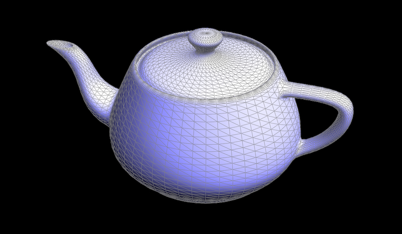
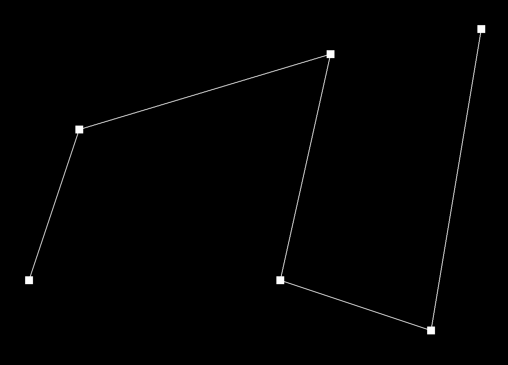
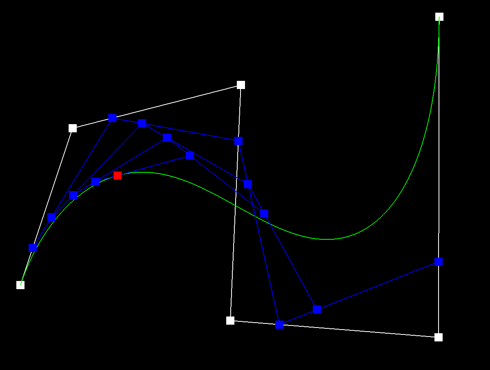
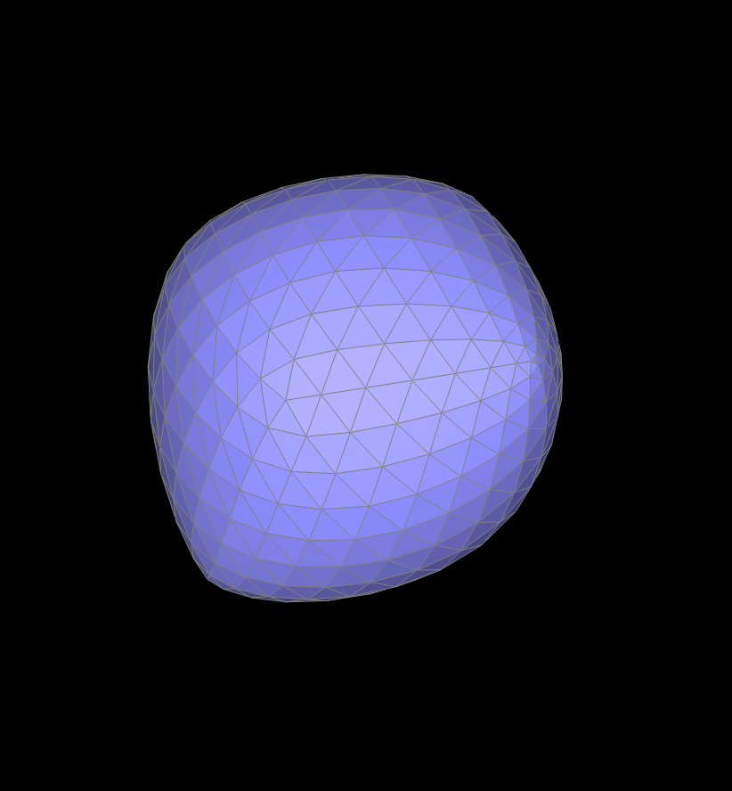

# Overview
In this project, we explored the ideas behind geometric modeling of curves and surfaces.

We began by looking at Bezier curves and interpolating points along them with the 1D de Casteljau's algorithm. Starting with the control points, we recursively (or iteratively) reduce the number of points at each step. Altogether, we end up with a quick algorithm to evaluate points along the continuous curve.

Afterwards, we extended the algorithm to work on Bezier surfaces. Although seemingly difficult at first, we were able to simplify the task a lot by applying the 1D algorithm along one axis then to the other to get a point along our curved surface. 

While Bezier surfaces result in a smooth contour, they are difficult to render directly. So, we moved onto triangle meshes where surfaces are made of many triangles joined at their edges. One general problem we looked at with rendering surfaces was shading, specifically implementing area-weighted vertex normals to support Phong shading. It took awhile, but we were able to leverage vector cross products to compute normals related to faces and take the weighted average over them.

We then moved onto edge operations to alter the mesh structure. In order to implement these operations, we had to first understand the half-edge datastructure and the distinctions between half-edges, edges, vertices, and faces, as well as the relationships between different half-edges. Once we were familiar with half-edges, we started by implementing an edge flip. This operation involved making many updates to the different attributes of each triangle and how they interacted with each other. We made a couple of mistakes along the way that led to our mesh rendering with holes, but a careful second look through the code helped us catch all the errors.

Another mesh operation we implemented was an edge split. This operation involved even more updates to our half-edge data structure, but it went a lot faster after having the experience from implementing the edge flip. Once again, we made a couple mistakes in how we updated our mesh the first time through, but we reviewed each line of our code carefully to catch those errors. 

Lastly, we put everything together to create an upsampling algorithm with loop subdivision. This algorithm involved using a combination of edge flips and splits and recomputing the positions of each vertex in the mesh to divide our triangle mesh into even smaller triangles. The algorithm had a lot of details that we had to get right during implementation, like distinguishing old and new vertices/edges and making sure our loops weren't iterating over incorrect items, so it took a few attempts to get it correct. Additionally, we initially forgot to reset our indicators for whether vertices were new or old, so multiple upsamplings would fail. After figuring out this issue and resolving it, we had a working algorithm!

We covered a lot of different techniques during this project, and some interesting thoughts and challenges we experienced during the project included:

1. Rather than finding analytical solutions, using recursion or iteration can lead to easier/faster approaches
2. How to assign vertices, edges, halfedges, and faces after mesh operations to minimize the number of updates
3. The tradeoffs between computational load and accuracy of the surfaces
4. Some algorithms like loop subdivision improve certain surface features, while losing others (like sharp corners)

Overall, we learned a lot about what goes into rendering surfaces and some of the methods that are used to do so!

# Part 1: Bezier Curves with 1D de Casteljau Subdivision
de Casteljau’s algorithm is a recursive algorithm for interpolating points on Bezier curves. For example, if we want to evaluate a Bezier curve at $t$, then at each recursive step, we linearly interpolate between pairs of consecutive control points using $t$. After each step, we end up with one less point. By continuing to recurse until we end up with one point, we find the single interpolated point along the curve!

Here's what the algorithm looks like with 6 original control points.
<!-- table -->

| Control points | Step 1 |
|:---:|:---:|
|  |  |

| Step 2 | Step 3|
|:---:|:---:|
|  |  |

| Step 4 | Result |
|:---:|:---:|
|  | |

We can also move the control points around and modify the parameter *t*.

|:---:|:---:|
|  | |
|  | |

Here's an animated version showing this!

{:style="display:block; margin-left: auto; margin-right: auto; width:70%;"}

# Part 2: Bezier Surfaces with Separable 1D de Casteljau

<!-- Briefly explain how de Casteljau algorithm extends to Bezier surfaces and how you implemented it in order to evaluate Bezier surfaces. -->
<!-- Show a screenshot of bez/teapot.bez (not .dae) evaluated by your implementation. -->

For Bezier surfaces, each point is represented by a 3D vector and each surface is defined by a grid of these points. Along one direction of the grid, we first group up points along that direction (e.g. one set per row or column) and run 1D de Casteljau's algorithm to interpolate along the Bezier curves defined by each set of control points. We then take the results of these interpolations and use 1D de Casteljau's again to interpolate along the Bezier curve that is defined.

When we implemented this algorithm to interpolate the point with parameters $(u, v)$ along some Bezier surface, we first filled in the `evaluate1D` function that evaluates a point on a Bezier curve using parameter $t$. Then, we used `evaluate1D` and parameter $u$ to evaluate points along each row. Then, we took the resulting points and made a final interpolation with `evaluate1D` and parameter $v$ to get a single point along the Bezier surface.

Here's our teapot generated with Bezier surfaces:

{:style="display:block; margin-left: auto; margin-right: auto; width:70%;"}

# Part 3: Area-Weighted Vertex Normals
To implement area-weighted vertex normals, we first computed the area. For each adjacent face, we would get the position vectors of the three vertices $v1$, $v2$, and $v3$. Then, we took the cross-product of $v2 - v1$ and $v3 - v1$ to get a vector in the normal direction with norm equal to two times the area of the face. We summed together these normal vectors over all of the faces, and then normalized it by calling `Vector3D::normal()`.

Here is the teapot with flat shading and Phong shading.

<!-- table -->

| Flat shading | Phong shading |
|:---:|:---:|
|  |  |

# Part 4: Edge Flip

<!-- Briefly explain how you implemented the edge flip operation and describe any interesting implementation / debugging tricks you have used.
Show screenshots of a mesh before and after some edge flips. -->
We used the primer's guidance on edge flip and drew out the before- and after-flip diagrams for a given edge.
The primer's diagram for edge flip is shown below. Using this diagram, we updated every halfedge, vertex, edge, and face by following the diagram.

<!-- table -->

| Before | After |
|:---:|:---:|
|  |  |


Here's a couple screenshots of our mesh before and after edge flips.

| Before flip | After flip |
|:---:|:---:|
|  |  |

<!-- Write about your eventful debugging journey, if you have experienced one. -->

Our code did not work on the first try - we had some holes in our teapot. We tried to use the halfedge pointers and debugging tools
on the GUI and the CLion debugger but this did not end up so useful. In the end, we double-checked our pointer assignments
and found that we had totally forgotten to update the edges and vertices (only doing halfedges)! After we implemented that,
our code worked.

# Part 5: Edge Split

<!-- Briefly explain how you implemented the edge split operation and describe any interesting implementation / debugging tricks you have used. -->

Similarly to edge flip, we drew out the before- and after-split diagrams for a given edge. Our diagram is below.

<!-- table -->

| Before | After |
|:---:|:---:|
|  |  |

<!-- Show screenshots of a mesh before and after some edge splits. -->
Here's a screenshot of our mesh before and after edge splits.

| Before split | After split |
|:---:|:---:|
|  |  |

<!-- Show screenshots of a mesh before and after a combination of both edge splits and edge flips. -->
Here's a screenshot of our mesh before and after edge flips and splits.

| Before flip + split | After flip + split |
|:---:|:---:|
|  |  |

<!-- Write about your eventful debugging journey, if you have experienced one. -->

On first try, our code crashed the GUI. We tried to debug this by using the CLion debugger and seeing what was throwing the exception.
Unbeknownst to us, the GUI was not crashing due to an exception, but rather an infinite loop. After re-inspecting our pointer
manipulation, we discovered that we had erroneously updated some of the `next` pointers, resulting in three of them not forming a cycle so our while loop wouldn't end.
After we squashed this bug, we were able to split edges without issues.

<!-- If you have implemented support for boundary edges, show screenshots of your implementation properly handling split operations on boundary edges. -->

# Part 6: Loop Subdivision

<!-- Briefly explain how you implemented the loop subdivision and describe any interesting implementation / debugging tricks you have used. -->

We ran into issues with discerning the new vertices and edges from the old ones, so we begin the algorithm
by inserting all of them into a vector to easily keep track of them. Then we implemented the pseudocode given in the spec and skeleton.

1. For each vertex and edge in the mesh, set their `isNew` property to `false`.
2. Compute new positions for all the vertices in the input mesh, using the Loop subdivision rule, and store them in `Vertex::newPosition`.

    We did this by looping from `mesh.verticesBegin()` to `mesh.verticesEnd()`. We did a traversal on each vertex to get each neighbor, computing the sum of the neighbor positions.

    

    ```cpp
    v->newPosition = (1 - n * u) * v->position + 
                     u * neighbor_position_sum;
    ```

{:start='3'}
3. Compute the updated vertex positions associated with edges, and store it in `Edge::newPosition`.
   Looping from `mesh.edgesBegin()` to `mesh.edgesEnd()`, we computed the new position for each edge using the formula given in the spec.

    ```cpp
    e->newPosition = 3.0 / 8 * (A + B) + 1. / 8 * (C + D);
    ```

4. We then consider the original edges only by adding them all to a vector, then splitting each edge in that vector.
   In this manner we ensure that we do not loop through the newly created edges. We also needed to modify our
   `edgeSplit` so that the newly created edge's `isNew` is `true`.

5. Then, we flip any new edge connecting a new and old vertex. We do this by taking the exclusive disjunction of the edge's
   endpoints' `isNew` properties, and flipping if the original edge was also new.

6. Finally, we loop through all the vertices in the mesh and reassign its position to `newPosition` as calculated in step 2.

<!-- Take some notes, as well as some screenshots, of your observations on how meshes behave after loop subdivision. What happens to sharp corners and edges? Can you reduce this effect by pre-splitting some edges? -->
<!-- Load dae/cube.dae. Perform several iterations of loop subdivision on the cube. Notice that the cube becomes slightly asymmetric after repeated subdivisions. Can you pre-process the cube with edge flips and splits so that the cube subdivides symmetrically? Document these effects and explain why they occur. Also explain how your pre-processing helps alleviate the effects. -->
<!-- If you have implemented any extra credit extensions, explain what you did and document how they work with screenshots. -->

With loop subdivision, we noticed that the sharp corners and edges become rounded out. This occurs because we are creating more
vertices in the middle of the edges and also updating positions of vertices to act like averages of the surrounding vertices. This update effectively achieving something emulating blur from images where sharp changes become more muted. By pre-splitting edges, we can reduce the averaging effect. However, it is not possible to completely eliminate the effect.

An example of this rounding out can be seen when rendering the cow. Especially around the cow's face and horns, sharp edges become smoother after a single loop subdivision.

|:---:|:---:|
|  |  |

*Added on 3/10 for regrade request*
When we performed loop subdivision on the cube, we saw that it divided asymmetrically.

|:---:|:---:|
|  |  |
|  |  |

{:style="display:block; margin-left: auto; margin-right: auto; width:50%;"}


We hypothesize that the cube becomes slightly asymmetric after repeated subdivisions because the corners are not all the same
for each face (due to the asymmetrical edge orientations over the faces of the cube). The ones that are the vertex of two triangles of a face become subdivided differently than the ones that are the vertex
of only one triangle of that face. To solve this, our pre-processing step involves splitting the diagonal edges of the cube on
each face so that the vertices of the cube all become identical. This process can be seen below.

|:---:|:---:|
|  |  |
|  |  |

Here's an animated version, too.

{:style="display:block; margin-left: auto; margin-right: auto; width:50%;"}
