# Overview

For this project, we implemented additional features on top of Project 3-1. We added support for different types of materials, including mirror and glass objects, allowing to render interesting scenes with many reflections and refractions. We also added support for microfacet materials and textures, allowing us to render more realistic materials.

Both of these tasks were fairly straightforward and involved translating the formulas and pseudocode from the spec into C++. Most of the challenges encountered were the result of mistranslation or small typos, and a re-read of the spec or code usually solved the problem. For task 2, there were some tricky parts, such as reflecting over a given line in 3D space, but Ed was a good resource here, with many other students already encountering the same problems and helpfully offering solutions.

Overall, we found this project very rewarding as we were able to render neat objects for visual gratification and it wasn't too difficult.

# Part 1: Mirror and Glass Materials

In this part of the project, we implemented models for different types of reflection and refraction. This involved modifying the `advanced_bsdf.cpp` file to create new types of BSDFs. We started with a mirror BSDF, where we implemented perfect specular reflection where the incident angle is equal to the outgoing angle. We then created a refraction BSDF that modified the outgoing angle based on the ratio between indices of refraction. Finally, we implemented a BSDF for glass materials that combined reflections and refractions probabilistically. 

For `max_ray_depth` values of 0, 1, 2, 3, 4, 5, and 100, we generated these images. These images used a sample rate of 1024 and 16 samples per light.

### max_ray_depth = 0

{:style="display:block; margin-left: auto; margin-right: auto; width:70%;"}

For this `max_ray_depth`, the only rays that we trace are the ones that directly hit the light from the camera, without any bounces. So, we see the bright area light at the top of the ceiling.

### max_ray_depth = 1

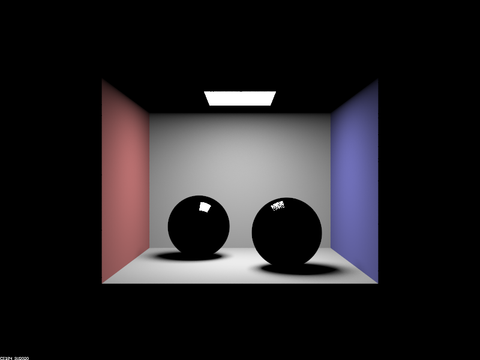{:style="display:block; margin-left: auto; margin-right: auto; width:70%;"}

This image now includes all one bounce effects. Light reflects off of the walls, as well as the spheres. For the mirror sphere on the left, we see a bright patch representing the light that comes from the light, reflects perfectly over the normal at the intersection point, then to the camera. We see a similar patch on the right sphere, but it is contains speckles where the light refracts instead. So, some of the rays reflect to the camera while others get refracted (the effect of these rays won't be seen until larger `max_ray_depth` values).

### max_ray_depth = 2

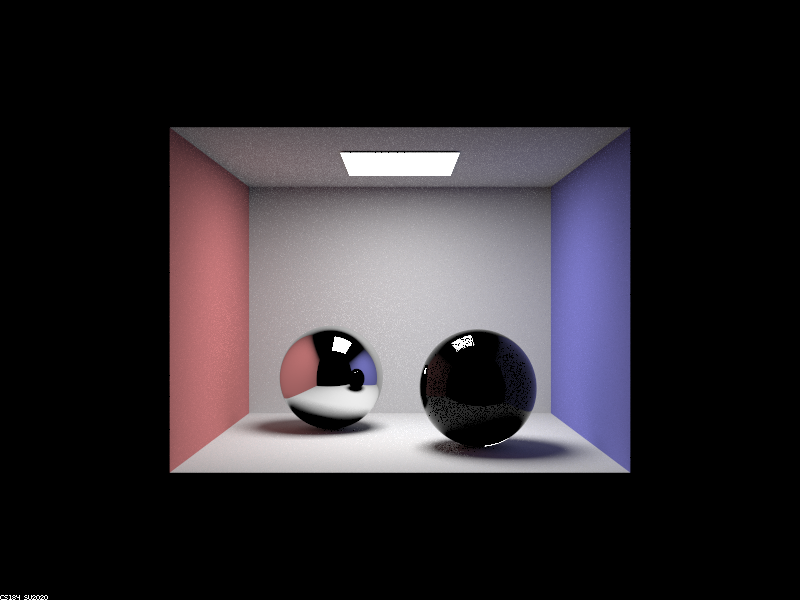{:style="display:block; margin-left: auto; margin-right: auto; width:70%;"}

The new two bounce effects can be seen in a couple locations. First, the ceiling appears bright now because of light that reflects off the ground/top of the spheres, then off the ceiling, before finally reaching the camera. Additionally, spheres also show two bounce effects. In the left sphere, we see light rays that have bounced off one of walls before reflecting off the sphere and into the camera. In the right sphere, we see similar reflections from the walls, though not as pronounced. We also see a bright patch that's appeared on the bottom right, which is caused by light that has come from the light, refracted going into the sphere, and then refracted leaving the sphere.

### max_ray_depth = 3

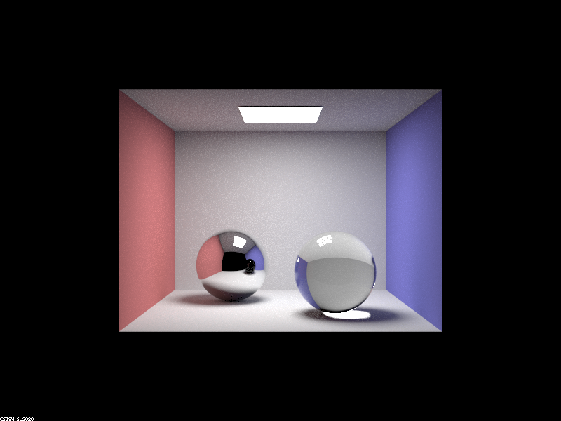{:style="display:block; margin-left: auto; margin-right: auto; width:70%;"}

Most of the new bounce effects can be seen in the spheres. The left sphere now reflects an illuminated ceiling, which comes from rays that (1) bounced off the ground, (2) bounced off the ceiling, and finally (3) bounced off the sphere's surface. The right sphere shows even more effects. First, we now see light that's reflected off the walls of the room before refracting through the glass--(1) reflect off a wall, (2) refract into the glass sphere, (3) refract out of the sphere and into the camera. We also see light that has refracted through the glass sphere before bouncing off of the ground and into the camera. 

### max_ray_depth = 4

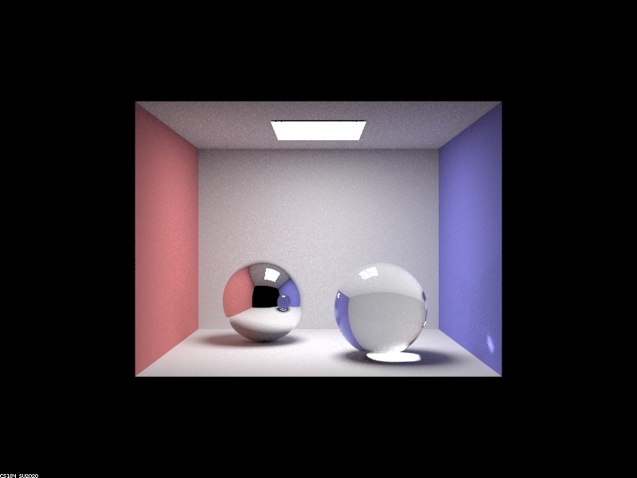{:style="display:block; margin-left: auto; margin-right: auto; width:70%;"}

Once again, the spheres show most of the new bounce effects. In the left sphere, we see that the reflection of the other sphere has turned blue. This is because light that (1) reflected off of the right wall, (2) refracted into the right sphere, (3) refracted out of the right sphere, and (4) reflected off of the mirror surface of the left sphere are now included. A couple changes to the right sphere can also be seen. The spot on the ground right beneath the sphere has brightened. This could be due to light that either bounced off the back wall, refracted through the sphere, then reflected off the ground or from light that refracted into the sphere, internally reflected, then refracted out of the sphere, before bouncing off the ground. We also see a spot has appeared on the right wall due to light that reflected off the left wall, refracted through the sphere, and then bounced off of the right wall.

### max_ray_depth = 5

{:style="display:block; margin-left: auto; margin-right: auto; width:70%;"}

The main difference between a `max_ray_depth` of 4 and 5 is that the image is brighter. This can be seen best in the right sphere. One source of this change could be that more rays that bounced around inside the sphere due to total internal reflection now refract out of the sphere and into the camera. For example, rays that bounce off the back wall, refract into the sphere, bounce twice in the sphere, and then refract out of the sphere would now be counted. 

### max_ray_depth = 100

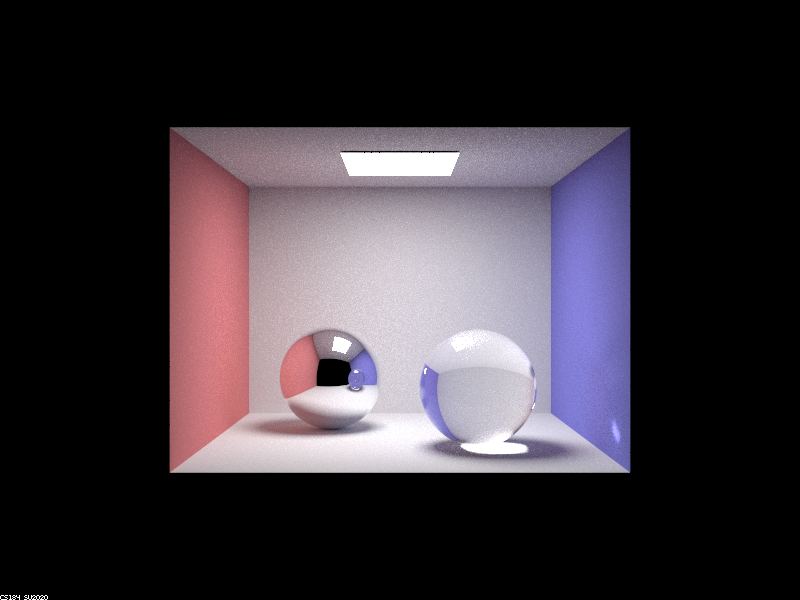{:style="display:block; margin-left: auto; margin-right: auto; width:70%;"}

With `max_ray_depth` set to 100, the image becomes brighter again. Another notable effect is seen on the top of the right sphere, where a new fuzzy, bright spot has appeared. This effect is introduced when `max_ray_depth` is 6 and becomes more prominent for larger ray depths. This might be caused by rays that internally reflect multiple times before exiting: for example, a ray might bounce off the back wall, refract into the sphere, internally reflect 5 times, and finally refract out of the right sphere toward the camera.

## Part 2: Microfacet Material

Microfacet materials approximate a surface as a bunch of tiny mirrors, each angled in their own normal direction. For Part 2, we implemented a BSDF function for microfacet materials: $f = \frac{F(\omega_i)G(\omega_o, \omega_i)D(h)}{4(n \dot \omega_o)(n \dot \omega_i)}$. We then experimented with different parameters in the function, like $\eta$, $k$, and $\alpha$ that determine the indices of refraction and roughness of the materials.

Here are the different renderings of `CBdragon_microfacet_au.dae` with different $\alpha$ values.

| $\alpha = 0.005$ | $\alpha = 0.05$ |
|:---:|:---:|
| 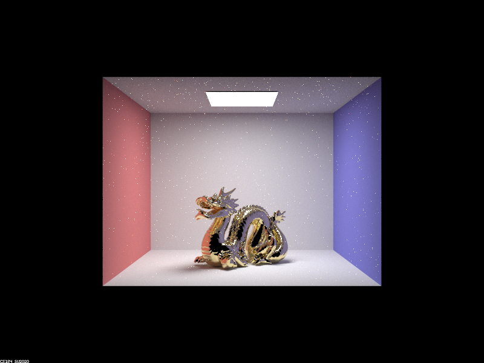 | 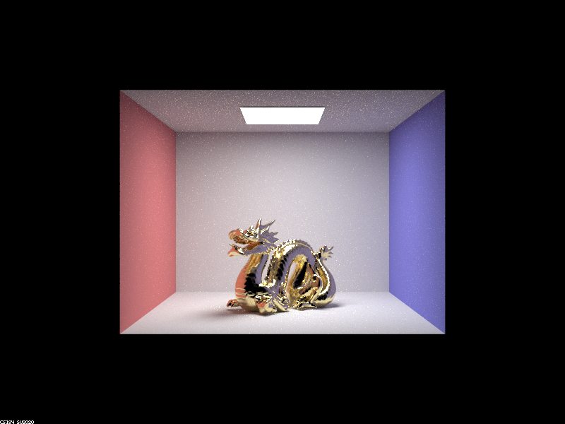 |
| $\alpha = 0.25$ | $\alpha = 0.5$ |
| 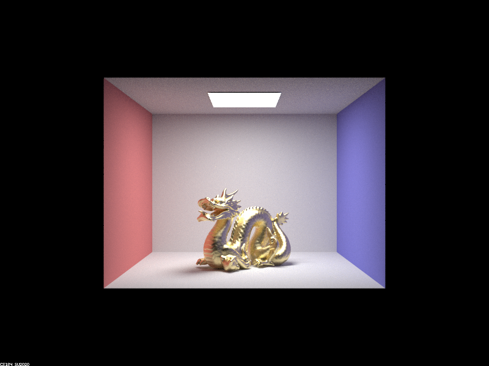 | 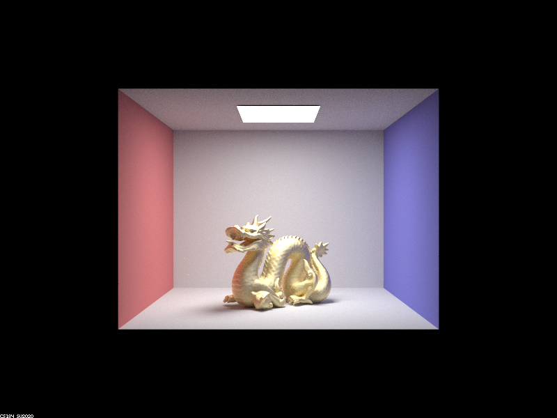 |

For $\alpha = 0.005$, the material looks like a gold-tinted mirror the dragon specularly reflects a lot of the light towards the camera. This means that the light must hit the dragon at a near-perfect angle in order to eventually reach the camera. The parts of the dragon that are facing away from the light are almost completely dark. We can also the reflection of the red and blue colored walls on the two sides of the dragon very clearly.

In the image where $\alpha = 0.05$, the material still looks almost mirror-like and shiny, it is not as pronounced. We can see differences especially in the glare on the top of the dragon's back, which spreads further out in this image than the previous one. Additionally, the reflections seems a bit softer and the variations in color due to the angle of the dragon's have smoothed out a bit.

The next image is $\alpha = 0.25$ and we can see a drastic difference in how the dragon looks. At this point, the material is still shiny, but seems to reflect light in more of a diffuse way. The darker regions in the previous two images now seem to reflect some light towards the camera. Additionally, the reflections from the walls isn't as strong as before. Overall, the color of the dragon has noticeably changed to more of a yellow-gold color.

Finally, in the $\alpha = 0.5$ image, the dragon has become less shiny and takes on a more dull gold look. We still see shading, but it's much less than the first two images because this material is closer to a diffuse reflection, so light from any direction could bounce and reach the camera.

We also implemented importance sampling for this section, which can be seen through a comparison on the `CBbunny_microfacet_cu.dae` file.

| Cosine Hemisphere Sampling | Importance Sampling |
|:---:|:---:|
| 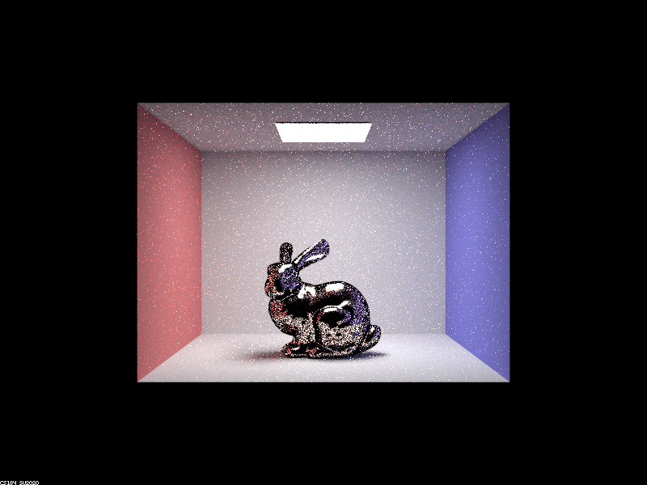 | 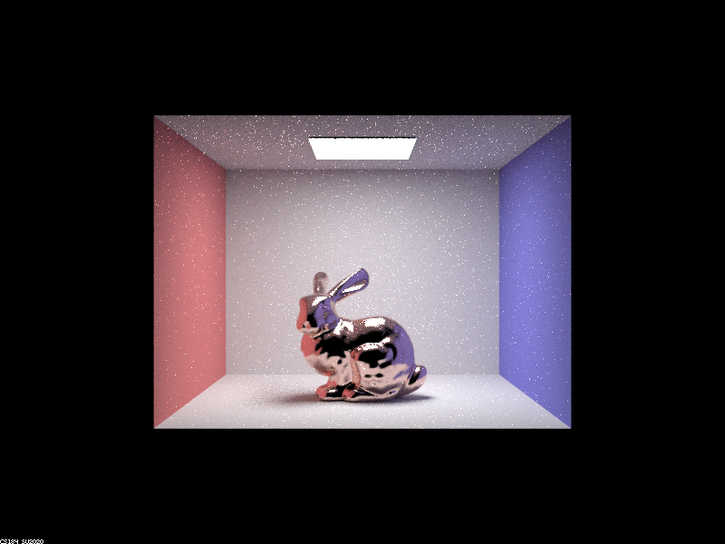 |

We see that the rendering with importance sampling seems to be much closer to convergence compared to cosine hemisphere sampling. With cosine sampling, the bunny still looks like it hasn't been completely rendered and there a lot of inconsistent dots across the bunny. The importance sampled image looks much better where even with a sample rate of 64 and 1 ray per light, all the shading and reflection patterns can be seen quite well.

Here are some examples of other materials. These were all rendered with 256 samples per pixel and 4 rays per light. The $\eta$ and $k$ values are given for 614 nm, 549 nm, and 466 nm like the spec.

| Silver | Aluminum |
|:---:|:---:|
| 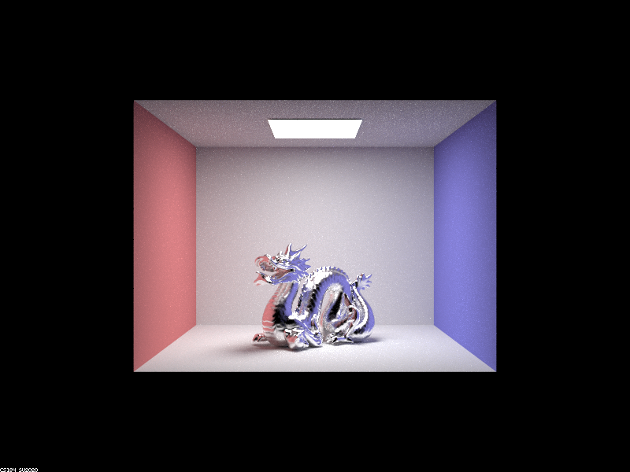 | 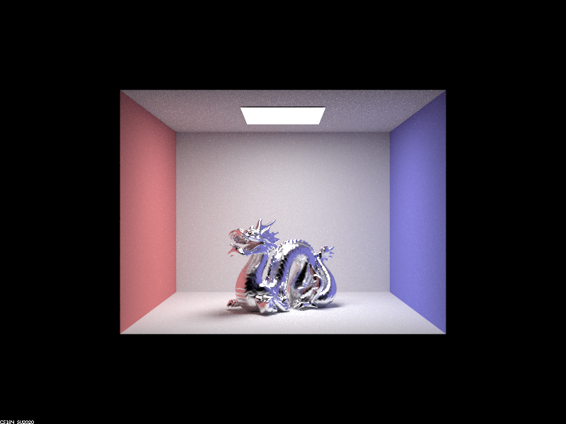 |
| $\eta = [0.048378, 0.051038,0.052384]$ | $\eta = [1.3352, 1.0109, 0.68955]$ |
| $k = [4.1148, 3.5683, 2.8284]$ | $k = [7.3398, 6.6157, 5.6471]$ |
| $\alpha = 0.1$ | $\alpha = 0.05$ |

## Partnership Reflection
For the first part, we worked together where each of us would implement the code on our own and help the other when needed. We learned that this worked pretty well when one of us would make a small mistake and the other could cross-check to see what they did differently. For the second part, Noah did the implementation and Allen wrote the writeup. Overall, we thought it worked pretty well for this project.