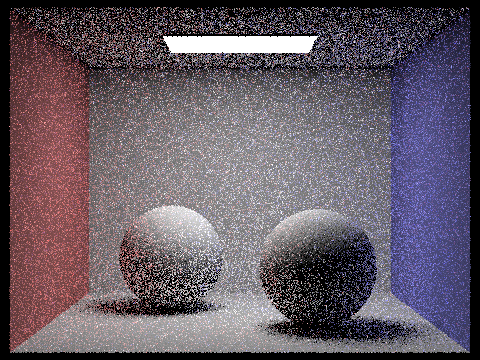
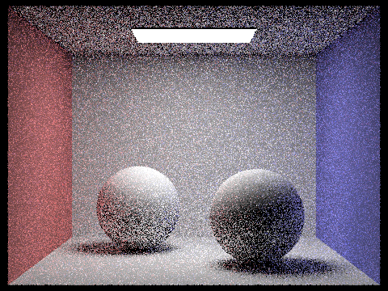
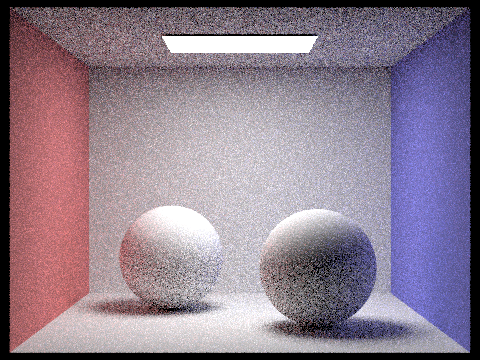

{:style="display:block; margin-left: auto; margin-right: auto; width:70%;"}

## Overview

In this project, we implemented a path tracer. We began by finding a way to
determine intersections for triangles and spheres in a naive manner. This
approach is intractable for high-poly meshes, so we implemented a bounding volume
hierarchy (BVH) to accelerate the intersection tests. From here, we implemented
lighting for diffuse materials, and estimated the lighting integrals using Monte
Carlo integration. We improved our sampling algorithm by using importance
sampling for lights. We implemented a recursive ray tracing algorithm to handle
reflections and refractions, or indirect lighting, with Russian roulette to
terminate rays. Finally, we determined a way to prioritize drawing samples for
high-frequency areas of images that need more samples to converge, resulting in
a significant performance boost to our ray tracing algorithm.

We mostly implemented these features by using the pseudocode and formulas from
the spec and slides. When implementing the BVH, though, we strayed off the
beaten path - we sorted the iterators using `std::sort` by the longest axis and
used pointer arithmetic to find the median centroid. In this way, we would never
have to deal with the case where no splitting is done. 

We ran into many segmentation faults and slightly incorrect renders during this
project. We were able to solve them via print debugging and the CLion exception
break, though it was very difficult because of the rendering code. We completed
all of the coding portion before the write-up, so portions where we had to go
back and change our code suddenly became very painful because we had forgotten
to change one small thing such as turning off adaptive sampling or not running
`cmake`, etc. It was made more punishing because some of the renders took hours
to run, and we ran with some incorrect settings.

## Part 1: Ray Generation and Scene Intersection (20 Points)

<!-- Walk through the ray generation and primitive intersection parts of the rendering pipeline. -->

During ray generation, we take a coordinate in the image and create a corresponding ray in the world space. 

The first step involves taking a normalized image coordinate ($(x, y)$ where $x, y \in [0, 1]$) and converting it to the camera space. Specifically, the camera space assumes there's a sensor at $z = -1$ and has corners at $(-\tan(\frac{\text{hFov}}{2}), -\tan(\frac{\text{vFov}}{2}), -1)$ and $(\tan(\frac{\text{hFov}}{2}), \tan(\frac{\text{vFov}}{2}), -1)$. By taking $(x, y)$ and linearly interpolating along the axes of the rectangles, we get the camera space coordinates.

$x_C = (1 - x) \cdot -\tan(\frac{\text{hFov}}{2}) + x \cdot \tan(\frac{\text{hFov}}{2})$

$y_C = (1 - y) \cdot -\tan(\frac{\text{vFov}}{2}) + y \cdot \tan(\frac{\text{vFov}}{2})$

$z_C = -1$

Then, to get a ray in the world space, we set the origin of the ray to the camera's position and we multiply the camera-space vector by our camera-to-world coordinate transform matrix `c2w`.

Now that we are able to generate a ray given a coordinate in the image space, we utilized it to sample pixels of the image. In each pixel, we use a sampler to choose points within the pixel. For each point, we generate a ray that goes through it and compute the average radiance along all our sampled rays. We accumulate this information in our sample buffer.

To sample along each ray direction, we also need to know where our ray intersects different objects (primitives) inside of our world. During this part of the project, we implemented intersections for both triangles and spheres. Overall, the process involves first running a primitive-ray intersection test, then setting variables like the normal direction, distance until intersection, BSDF at the intersection point, and so on.

<!-- Explain the triangle intersection algorithm you implemented in your own words. -->

For example, with triangle intersection, we compute the intersection point using the [Moller-Trumbore algorithm](https://cs184.eecs.berkeley.edu/sp23/lecture/9-22/intro-to-ray-tracing-and-acceler). This algorithm solves for $t, b_1, b_2$ where $t$ is the ray parameter and $b_1, b_2$ are two of the barycentric coordinates of the triangle we're checking intersection with.

In order to be an intersection, `t` must be between the ray's `min_t` and `max_t` variables and the barycentric coordinates must be non-negative.

Additionally, upon intersection, we need to update some of the variables in `isect`. Specifically, we want to update the ray's `max_t` to `t` because we don't want to consider intersections behind the one we just found. We also want to use the barycentric coordinates to interpolate the normal direction using the normals at the vertices. Finally, we want to set the primitive and it's corresponding BSDF.

<!-- Show images with normal shading for a few small .dae files. -->

| **CBspheres.dae** | **CBcoil.dae** |
|:---:|:---:|
|  |  |
| **cow.dae** | **bench.dae** |
|  |  |

## Part 2: Bounding Volume Hierarchy (20 Points)

### Walk through your BVH construction algorithm. Explain the heuristic you chose for picking the splitting point.

Our BVH construction algorithm recursively creates the BVH nodes by splitting at the median centroid along the longest axis and terminating when there are fewer than `max_leaf_size` primitives left.

First, we compute the bounding box `bbox` of all primitives in the node by looping through the node and expanding by the primitive's bounding box. Using this bounding box, we create a new BVH node.

If the BVH node we created contains fewer than `max_leaf_size` primitives, it will be a leaf node with all of the primitives.

Otherwise, we must split the BVH node further. In order to do so, we use the `extent` variable and find the longest axis of the bounding box. Then, we sort the primitives from `start` to `end`, ordered by their centroid's position along this axis. This sorting is in-place and we never need to create more vectors to hold primitives (see Extra Credit). We then take the median centroid `mid` to split on using pointer arithmetic and recursively construct the left and right BVH nodes with all the primitives from `start` to `mid` and `mid` to `end`, respectively. Because we're using the median in this manner, there will always be non-empty collections of primitives on each side of the split.

Here are some images showing the results of our BVH.

|  |  |
|:---:|:---:|
|  |  |

<!-- Show images with normal shading for a few large .dae files that you can only render with BVH acceleration. -->

<!-- Example of including multiple figures -->

Here are some images that could be rendered in reasonable time now that we've implemented BVH acceleration.

| **CBlucy.dae** | **CBdragon.dae** |
|:---:|:---:|
|  |  |
| **blob.dae** | **wall-e.dae** |
|  |  |

<!-- Compare rendering times on a few scenes with moderately complex geometries with and without BVH acceleration. Present your results in a one-paragraph analysis. -->

Comparing rendering times with and without BVH acceleration, our BVH acceleration resulted in speedup for most images, sometimes orders of magnitudes faster, when rendering images. As the number of primitives in the object increased, the speedup became more and more noticeable. However, if there were only a handful of primitives (like CBspheres), not using BVH was faster because there's less overhead. The results from a couple of these images are compiled below:

| Image | Rendering Time without BVH (s) | Rendering Time with BVH (s) |
|:---:|:---:|:---:|
| CBspheres | 0.0428 | 0.0502 |
| teapot | 2.4553 | 0.0572 |
| cow | 5.4124 | 0.0569 |
| bunny | 38.2385 | 0.0806 |


## Part 3: Direct Illumination (20 Points)

### Walk through both implementations of the direct lighting function.

For hemisphere sampling, we first sample for $w_i$, convert it to the world space, and create a ray. This ray is then used to intersect with the object's BVH. Once we get the intersection point, we can compute the term for the Monte Carlo estimation: $\frac{f_{BSDF}(w_{out} \rightarrow w_{in})L_i(p, w_{in})\cos(\theta_{in})}{p(w_in)}$. After averaging over the samples, we get the Monte Carlo estimation.

For lighting importance sampling, we instead loop through the scene's lights and sample some number of rays in the direction of each light: 1 for point lights and `ns_area_light` for area lights. For each light, we use `sample_L` to sample the in direction (because we're tracing rays in the inverse direction), also getting the distance to the light and PDF as well. Then, similar to hemisphere sampling, we compute the term for Monte Carlo estimation. And, after averaging, we get the overall estimation for the full integral.

### Show some images rendered with both implementations of the direct lighting function.

| Scene | Uniform Hemisphere Sampling | Importance Sampling |
|:---:|:---:|:---:|
| `CBempty.dae` |  |  |
| `CBspheres_lambertian.dae` |  |  |
| `CBbunny.dae` |  |  |

The above renders used a sample rate of 4 per pixel and 16 samples per light.

### Focus on one particular scene with at least one area light and compare the noise levels in soft shadows when rendering with 1, 4, 16, and 64 light rays (the -l flag) and with 1 sample per pixel (the -s flag) using light sampling, not uniform hemisphere sampling.

| Number of Light Rays | `CBbunny.dae` |
|:---:|:---:|
| 1 |  |
| 4 |  |
| 16 |  |
| 64 |  |

When sampling with more light rays, the shadow of the bunny becomes significantly softer, even with just one sample per pixel. This is because we are using importance sampling, so having more samples per light source has a smoothing effect for pixels that are on the edges of shadows, due to the fact that sometimes they will hit a point on the light and other times be obstructed. When we have more light rays, we can average this effect, so the shadows will become softer.

### Compare the results between uniform hemisphere sampling and lighting sampling in a one-paragraph analysis.

Uniform hemisphere sampling tended to be noisier than lighting sampling because a lot of the rays sampled in the uniform approach don't end up hitting the single light. As a result, fewer of the samples actually give useful information. On the other hand, lighting sampling specifically samples rays directed towards the light, so each sample gives a larger signal. Another difference between the two sampling methods is that lighting sampling probably converges faster. Each sample on average provides more useful information because it specifically targets in the light's direction, rather than a random direction that might not hit the light.


## Part 4: Global Illumination (20 Points)

### Walk through your implementation of the indirect lighting function.

For indirect lighting, we initialize rays with a depth equal to the maximum ray depth, and decrement for each bounce, recursing until we get to depth 0.

### Show some images rendered with global (direct and indirect) illumination. Use 1024 samples per pixel.

| Scene | Render |
|:---:|:---:|
| `CBspheres_lambertian.dae` |  |
| `blob.dae` |  |
| `dragon.dae` |  |
| `wall-e.dae` |  |

### Pick one scene and compare rendered views first with only direct illumination, then only indirect illumination. Use 1024 samples per pixel. (You will have to edit PathTracer::at_least_one_bounce_radiance(...) in your code to generate these views.)

| Only direct illumination | Only indirect illumination |
|:-------------:|:---:|
|  |   |

In direct illumination, we include both the zero bounce and no bounce radiance. For example, we see all of the light coming directly from the light source at the ceiling. We also see all the one bounce radiance either off the ball's top half or from the walls/floor of the box. Indirect illumination includes all the light from more than one bounces. On the left and right sides of the balls, we see rays that came from the light, reflected off of a wall, reflected off the ball, and then through the camera. We also see light that bounces off of a ball, off the walls, and then to the camera. In general, rays that bounces multiple times before reaching the camera (or light if you're tracing in the opposite direction) are included in this indirect illumination.


### For CBbunny.dae, compare rendered views with max_ray_depth set to 0, 1, 2, 3, and 100 (the -m flag). Use 1024 samples per pixel.

| `max_ray_depth` | `CBbunny.dae` render |
|:-------------:|:---:|
| 0 |   |
| 1 |   |
| 2 |   |
| 3 |   |
| 100 |   |


We generated each of these renders using Russian roulette with a termination probability of 0.3. As `max_ray_depth` increases, indirect lighting from reflections and bounces have more paths available to every single point. This means that the image will generally be brighter because there are more light "sources," (the reflections off non-light-source points) and we also will gain reflected colors (most easily seen in the slightly reddish-bluish ceiling of the 100-depth render). Also, the shadows become softer and are also tinted the color of the walls.

### Pick one scene and compare rendered views with various sample-per-pixel rates, including at least 1, 2, 4, 8, 16, 64, and 1024. Use 4 light rays.

| Sample Rate | `CBspheres.dae` render |
|:-------------:|:---:|
| 1 |   |
| 2 |   |
| 4 |   |
| 8 |   |
| 16 |   |
| 64 |   |
| 256 |   |
| 1024 |   |

For the above renders, we used 16 samples per area light, with a maximum ray depth of 1000. We can see that with more samples per pixel, the image gets significantly less noisy and appears slightly brighter.

<!-- TODO: Add reasoning why this is the case. -->

## Part 5: Adaptive Sampling (20 Points)

<!-- Explain adaptive sampling. Walk through your implementation of the adaptive sampling.
Pick one scene and render it with at least 2048 samples per pixel. Show a good sampling rate image with clearly visible differences in sampling rate over various regions and pixels. Include both your sample rate image, which shows your how your adaptive sampling changes depending on which part of the image you are rendering, and your noise-free rendered result. Use 1 sample per light and at least 5 for max ray depth. -->

### Explain adaptive sampling. Walk through your implementation of the adaptive sampling.

Adaptive sampling is where we sample high-frequency regions of the image more because lower-frequency regions do not require as many samples to become relatively noise-free. This is done by comparing the standard deviation of the samples for a pixel to a threshold value. If the threshold condition is met, more samples will likely not change the pixel's final value very much, so we can terminate computation early. If the threshold condition is not met, then we sample that pixel more to reduce the variance. We can also set a maximum number of samples per region to prevent pixels from being sampled too many times.

There is one subtle detail that makes this process difficult to implement in the code - we have three separate variances, for the R, G, and B channels in the image. We use the `illum` function of `Vector3D` to convert this to a single scalar value. From here, we accumulate the variables

$$\begin{align} s_1 &:= \sum_{i=1}^n \, \texttt{illum}(r_i) \\ s_2 &:= \sum_{i=1}^n \, \left(\texttt{illum}(r_i)\right)^2\end{align}$$

where $r_i$ is the estimated global illumination radiance of the $i$th sample. We then compute the desired statistics as

$$\begin{align} \mu &= \frac{s_1}{n} \\ \sigma^2 &= \frac{1}{n-1} \left(s_2 - \frac{s_1^2}{n}\right)\end{align}$$

where $\mu$ is the mean and $\sigma^2$ is the variance. The threshold condition is given by

$$ 1.96 \cdot \frac{\sigma}{\sqrt{n}} \leq \text{maxTolerance} \cdot \mu$$

If the statistics satisfy this condition, then no more sampling is done for that pixel. It would be unnecessarily costly to compute these statistics for every sample, so we instead check the stopping condition every `samplesPerBatch` samples.

This process speeds up the sampling process significantly while maintaining most of the quality, as shown in the following renders:

### Pick two scenes and render them with at least 2048 samples per pixel. Show a good sampling rate image with clearly visible differences in sampling rate over various regions and pixels. Include both your sample rate image, which shows your how your adaptive sampling changes depending on which part of the image you are rendering, and your noise-free rendered result. Use 1 sample per light and at least 5 for max ray depth.

We used a maximum tolerance of 0.05 for adaptive sampling, with 64 samples per batch, a sample rate of 2048, 1 sample per light, and a maximum ray depth of 5.

| Scene | Sample Rate Image | Rendered Image | Time to Render (s)
|:-------------:|:---:|:---:|:---:|
| `CBbunny.dae` (no adaptive) |   |   | 883 |
| `CBbunny.dae` (adaptive) |   |   | 651 |
| `wall-e.dae` (no adaptive) |   |   | 2157 |
| `wall-e.dae` (adaptive) |   |   | 1567 |

More-frequently-sampled regions are red, and less-frequently-sampled regions are blue. We can see that high-frequency (detailed) regions of the images are sampled more frequently and low-frequency (smooth) regions are sampled less frequently. This results in a significant speedup in rendering time while maintaining most of the quality.

## Extra Credit
- We implemented a more memory-efficient BVH where we only track pointers to a single vector of Primitives. To do so, we use the in-place sort method and sort based on the centroid location along the chosen axis. Then, we choose the median Primitive (based on the centroid's location), which is just the middle element in the now-sorted vector. Given $N$ primitives and $M$ max leaf size, the memory required for this BVH implementation would be $\Theta(N)$. A more naive implementation that creates new vectors at each level would require $\Theta(N)$ per level. Assuming we split pretty evenly, there would be $\Theta(\log(N / M))$ levels, giving a total memory of $\Theta(N\log(N / M))$.

```
BVHNode *BVHAccel::construct_bvh(std::vector<Primitive *>::iterator start,
                                 std::vector<Primitive *>::iterator end,
                                 size_t max_leaf_size) {
  BBox bbox;
  int count = 0;
  for (auto p = start; p != end; p++) {
    BBox bb = (*p)->get_bbox();
    bbox.expand(bb);
    count++;
  }

  BVHNode *node = new BVHNode(bbox);

  if (count <= max_leaf_size) {
    node->start = start;
    node->end = end;
  } else {
    Vector3D extent = bbox.extent;
    int largestAxis = 0;
    double largestAxisLength = extent[0];
    for (int i = 1; i <= 2; i++) {
      if (extent[i] > largestAxisLength) {
        largestAxisLength = extent[i];
        largestAxis = i;
      }
    }

    sort(start, end, [largestAxis](Primitive *p1, Primitive *p2) {
        return p1->get_bbox().centroid()[largestAxis] < p2->get_bbox().centroid()[largestAxis];
    });

    auto mid_it = start + (end - start) / 2;
    node->l = construct_bvh(start, mid_it, max_leaf_size);
    node->r = construct_bvh(mid_it, end, max_leaf_size);
  }

  return node;
}
```

## Partner Reflection

We regularly met up to work on the tasks synchronously (pair programming). We
found that it often felt like one person was doing all the work while the other
stood idly and watched, so we came up with a system where we would both
simultaneously try the task and whoever finished first would help the other one
debug their code. We found that this had all the benefits of pair programming
where we can bounce ideas off each other but also figure out the tasks on our
own. We split up the write-up by task. 

Overall, this project strengthened the concepts described in the overview,
and we learned a lot about how to debug and optimize code, especially some C++
tricks. The visual feedback from the renders was satisfying, but renders were
also quite frustrating to debug because 1) it is difficult to tell if the
renders are of the expected outputs, and 2) it is difficult to tell where the
errors would be in the code. We also learned about how to SSH into the hive
machines and detach processes to be safe in the case of disconnection.

