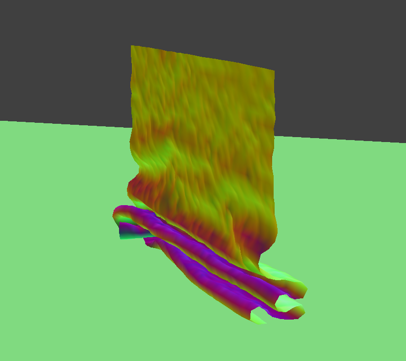
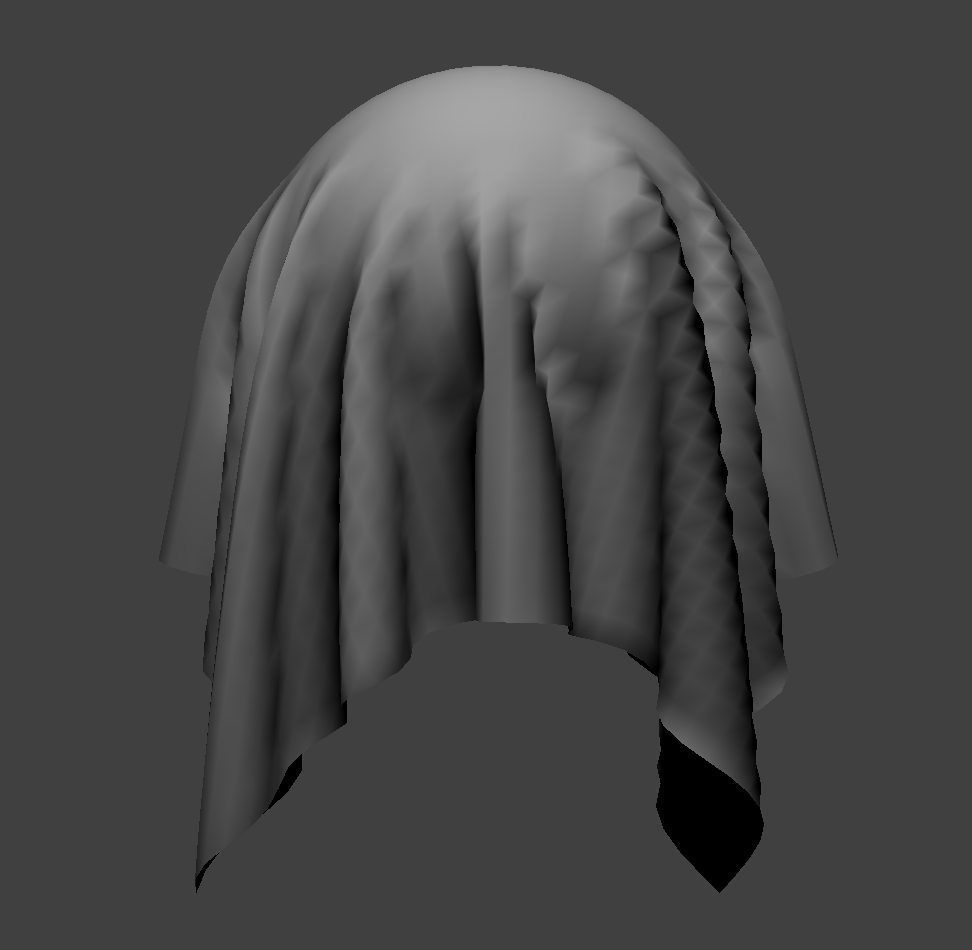
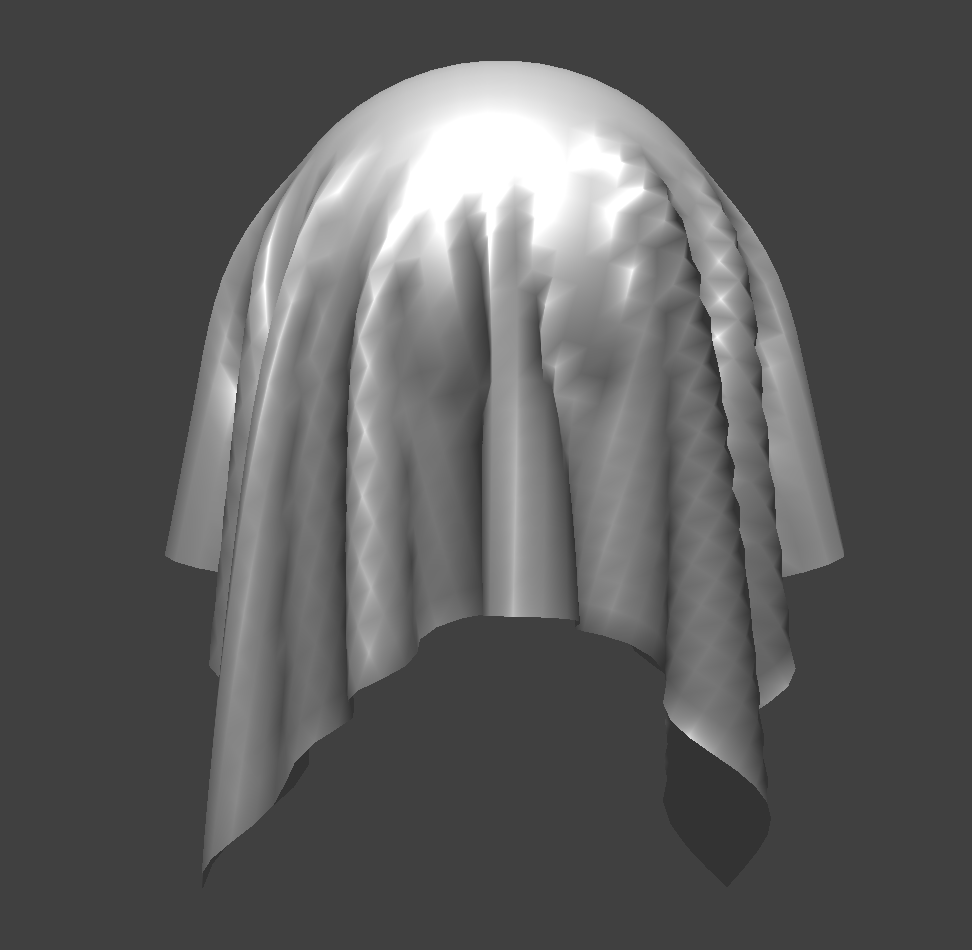
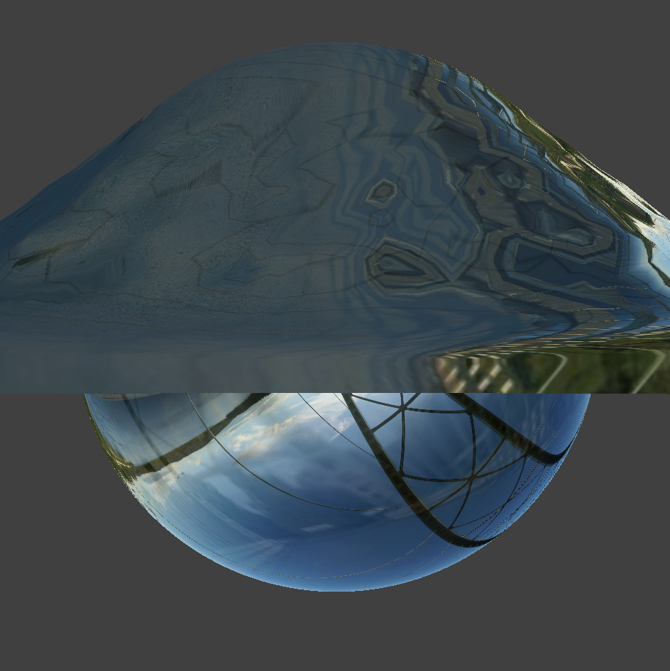

## Overview

## Part 1: Masses and Springs
<!-- Take some screenshots of scene/pinned2.json from a viewing angle where you can clearly see the cloth wireframe to show the structure of your point masses and springs.  -->

The cloth wireframe we created has this structure:

<!-- Show us what the wireframe looks like (1) without any shearing constraints, (2) with only shearing constraints, and (3) with all constraints. -->

| No Shearing | Only Shearing | All |
|:---:|:---:|:---:|
|  |  |  |

## Part 2: Simulation via Numerical Integration
<!-- Experiment with some the parameters in the simulation. To do so, pause the simulation at the start with P, modify the values of interest, and then resume by pressing P again. You can also restart the simulation at any time from the cloth's starting position by pressing R. 
- Describe the effects of changing the spring constant ks; how does the cloth behave from start to rest with a very low ks? A high ks?
- What about for density?
- What about for damping?
- For each of the above, observe any noticeable differences in the cloth compared to the default parameters and show us some screenshots of those interesting differences and describe when they occur.
-->

<!-- Show us a screenshot of your shaded cloth from scene/pinned4.json in its final resting state! If you choose to use different parameters than the default ones, please list them. -->

## Part 3: Handling Collisions with Other Objects
<!-- Show us screenshots of your shaded cloth from scene/sphere.json in its final resting state on the sphere using the default ks = 5000 as well as with ks = 500 and ks = 50000. Describe the differences in the results. -->

Here is our cloth colliding with a sphere. As the spring constant increases, the cloth seems to conform less to the shape of the sphere because the stronger spring force is able to better maintain the shape of the cloth. The higher the spring constant, the fewer the folds in the final resting cloth. 

| 500 N/m | 5000 N/m | 50000 N/m |
|:---:|:---:|:---:|
|  |  |  |

<!-- Show us a screenshot of your shaded cloth lying peacefully at rest on the plane. If you haven't by now, feel free to express your colorful creativity with the cloth! (You will need to complete the shaders portion first to show custom colors.) -->

Here is a very interesting collision between our cloth and a plane.

{:style="display:block; margin-left: auto; margin-right: auto; width:70%;"}

## Part 4: Handling Self-Collisions
<!-- Show us at least 3 screenshots that document how your cloth falls and folds on itself, starting with an early, initial self-collision and ending with the cloth at a more restful state (even if it is still slightly bouncy on the ground). -->

|  |  |
|:---:|:---:|
|  |  |

<!-- Vary the density as well as ks and describe with words and screenshots how they affect the behavior of the cloth as it falls on itself. -->

When varying the density and $k_s$ of the cloth, the main noticeable difference is in the folds that are created as the cloth falls. As the density gets smaller and the spring constant gets larger, the size of the folds gets larger. For example, the image for 1.5 g/cm^2 and 10000 N/m has few but wide folds. The 150 g/cm^2 and 100 N/m image is quite different, with many many small folds. Lower densities and larger spring constant cloths also fell at a slower rate as it's harder to fold when the spring constant is higher and weight is less heavy.

| | 100 N/m | 1000 N/m | 10000 N/m |
|:---:|:---:|:---:|:---:|
| 1.5 g/cm^2 |  |  |  |
| 15 g/cm^2 |  |  |  |
| 150 g/cm^2 |  |  |  |

## Part 5: Shaders
<!-- Explain in your own words what is a shader program and how vertex and fragment shaders work together to create lighting and material effects. -->
Shaders are programs that quickly perform computations to render 3D objects on the screen. With OpenGL, we have two types of shaders: vertex shaders that are applied to each vertex and fragment shaders which are applied to each pixel after rasterization. Given some 3D data that we want to display, the vertex shader first computes different properties of each vertex, like the normal direction, position, or (u, v) texture coordinate. This data can then be passed in and used by the fragment shader, which computes an output color for a given fragment (pixel). In the end, we have a shader program that performs a large portion of the rasterization pipeline!

<!-- Explain the Blinn-Phong shading model in your own words. Show a screenshot of your Blinn-Phong shader outputting only the ambient component, a screen shot only outputting the diffuse component, a screen shot only outputting the specular component, and one using the entire Blinn-Phong model. -->
From class, we learned the Blinn-Phong shading model, which accounts for light from three different sources: diffuse reflection, specular reflection, and ambient lighting. Altogether, this model is written as the equation:

$$L = k_a I_a + k_d(\frac{I}{r^2}) \max(0, n \cdot l) + k_s(\frac{I}{r^2}) \max(0, n \cdot h)^p$$

The diffuse lighting term comes from the assumption that light hitting some point scatters uniformly in a hemisphere. The specular lighting term represents surfaces where light bounces off like a mirror - if the angle between the incident direction and the normal is closer to the angle between the outgoing direction and the normal, then the amount of light reflected will be higher. Finally, we add an ambient lighting term to account for some base level of light (for example, a room will have some amount of illumination from light bouncing around).

| Ambient | Diffuse |
|:---:|:---:|
|  |  |
| **Specular** | **Phong** |
|  |  |

<!-- Show a screenshot of your texture mapping shader using your own custom texture by modifying the textures in /textures/. -->

We also implemented a texture mapping shader:

| | |
|:---:|:---:|
|  |  |

<!-- Show a screenshot of bump mapping on the cloth and on the sphere. Show a screenshot of displacement mapping on the sphere. Use the same texture for both renders. You can either provide your own texture or use one of the ones in the textures directory, BUT choose one that's not the default texture_2.png. Compare the two approaches and resulting renders in your own words. Compare how your the two shaders react to the sphere by changing the sphere mesh's coarseness by using -o 16 -a 16 and then -o 128 -a 128. -->

Afterwards, we wrote shaders for bump mapping and displacement mapping. Here is a comparison of the two:

| Bump | Displacement |
|:---:|:---:|
|  |  |
|  |  |

Although the resulting images are similar, the main difference is that bump mapping only updates the normals to match the texture geometry so the details seem to appear on the object. Displacement mapping, on the other hand, actually modifies the geometry and positions of vertices to match the texture as well.

When increasing the coarseness of the sphere, both mappings are noticeably rounder and closer to a perfect sphere. In displacement mapping, we also see that the texture becomes finer-grained because there are more vertices. With a higher resolution, the sphere appears to match the texture more closely.

| Shader | -o 16 -a 16 | -o 128 -a 128 |
|:---:|:---:|:---:|
| Bump |  |  |
| Displacement |  |  |

<!-- Show a screenshot of your mirror shader on the cloth and on the sphere. -->

Another shader we wrote acts like a mirror, reflecting off the surface and sampling from an environment map.

{:style="display:block; margin-left: auto; margin-right: auto; width:70%;"}

<!-- Explain what you did in your custom shader, if you made one. -->

Finally, we created a custom shader that adds refraction to our existing environment-mapped reflection shader and also incorporates a time element to make the image seem to rotate around the sphere over time. We added refraction similar to how we implemented reflection, except using Snell's law to compute the incident direction. Then, we sampled both directions using the environment map and mixed them together for the final 4D color output. To rotate the shading over time, we added a new uniform `t` that would be incremented every frame where the simulation is running. Then, we computed a rotation matrix where the phase was time-dependent. Multiplying both the incident refraction and reflection vectors brought everything together.

|  |  |
|:---:|:---:|
|  |  |
|  |  |

Here's a GIF of the simulation:

{:style="display:block; margin-left: auto; margin-right: auto; width:40%;"}

## Extra Credit
<!-- If you implemented any additional technical features for the cloth simulation, clearly describe what you did and provide screenshots that illustrate your work. If it is an improvement compared to something already existing on the cloth simulation, compare and contrast them both in words and in images. -->
